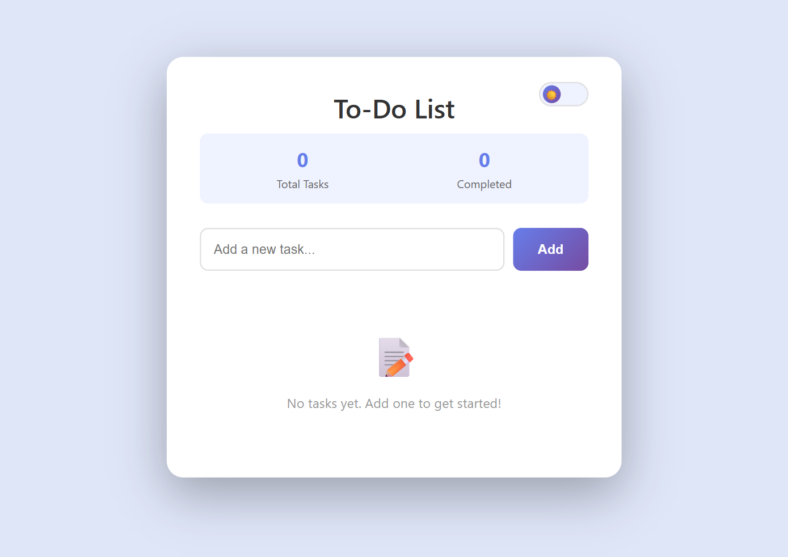
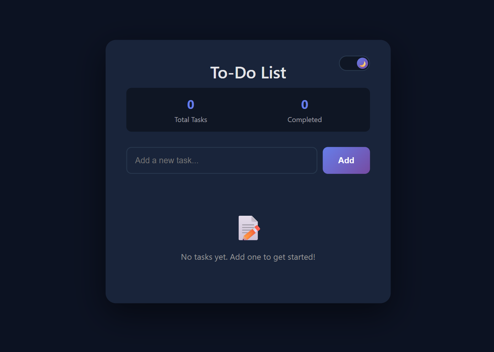

<h1 align="center">📝 To-Do List Web App</h1>

  <i>A clean, elegant, and responsive To-Do List built with pure HTML, CSS, and JavaScript.</i> 
  Designed with Apple-style minimalism, smooth animations, and a dark/light mode toggle.

  
  
  
  

---
## 🌐 Live Demo

🚀 The project is deployed and live on **Netlify**!  
👉 [**Visit the Website**](https://to-do-list-1-6.netlify.app/)

---
## 🌟 Overview

A modern, pastel-themed **To-Do List Web App** where you can:
- ✨ Add, edit, complete, and delete tasks  
- 🌓 Toggle between light and dark themes  
- 📊 Track total and completed tasks  
- 💾 Save your preferred theme automatically  

Built entirely with **vanilla JavaScript** — no frameworks, just clean logic and smooth UX.

---

## 🎨 Screenshots

| ☀️ Light Mode | 🌙 Dark Mode |
|:--------------:|:-------------:|
|  |  |

---

## 🚀 Features

✅ **Add Tasks** – via input field or Enter key  
✅ **Mark as Complete** – strike-through with smooth transition   
✅ **Delete Tasks** – fade-out animation for removal  
✅ **Dynamic Stats** – total and completed count update instantly  
✅ **Dark / Light Mode** – Apple-style theme with localStorage persistence  
✅ **Beautiful UI** – rounded cards, soft shadows, and pastel gradient buttons  
✅ **Fully Responsive** – optimized for mobile, tablet, and desktop  

---

## 🛠️ Tech Stack

| Technology | Purpose |
|-------------|----------|
| **HTML5** | Structure and semantic layout |
| **CSS3** | Styling, transitions, and theming |
| **JavaScript (ES6)** | Task logic, DOM handling, and theme toggle |
| **SF Pro / Inter Fonts** | Clean and professional typography |

---

